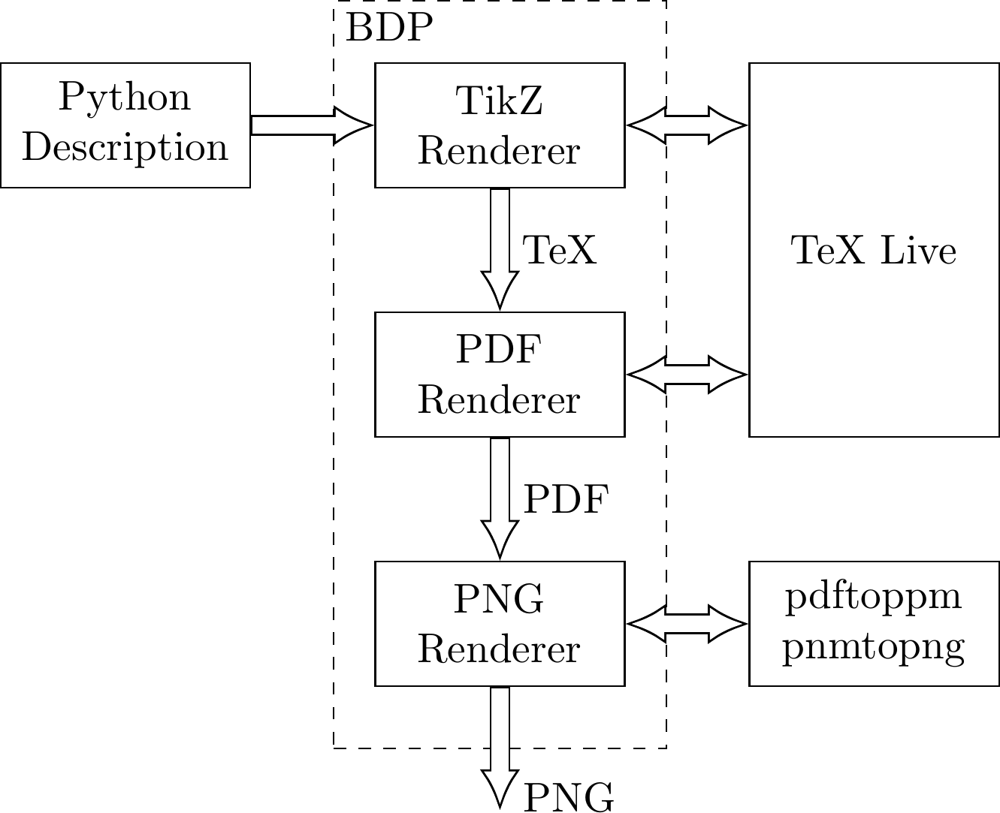

Welcome to BDP
==============

BDP (Block Diagrams in Python) aims to become a Python fronted for `TikZ <http://www.texample.net/tikz/>`_ when it comes to drawing block diagrams in order to facilitate the process. BDP wraps the `TikZ <http://www.texample.net/tikz/>`_ statements into the Python objects so that users can describe diagrams in pure Python. However, inserting raw `TikZ <http://www.texample.net/tikz/>`_ in BDP is also possible. Figure below shows an BDP example image which represents the BDP compilation process.

.. _fig-bdp-toolchain:

Figure can be rendered with the following Python code:

.. code-block:: python

    from bdp import *
    
    block.size=(6,3)
    block.nodesep=(3,3)
    
    BDP = block(r"BDP", alignment='nw', group='tight', group_margin=p(1,1.5), dashed=True)
    fig << block(r"Python \\ Description")
    BDP['tikz'] = prev(r"TikZ \\ Renderer").right()
    BDP['pdf'] = prev(r"PDF \\ Renderer").below()
    BDP['png'] = prev(r"PNG \\ Renderer").below()
    fig << prev(r"TeX Live", size=(6,9)).right(BDP['tikz'])
    fig << block(r"pdftoppm \\ pnmtopng").below(fig['Te*'])
    
    fig << BDP
    
    fig << path(fig['Pyt*'].e(0.5), BDP['tikz'].w(0.5), style='->')
    fig << path(fig['Tik*'].s(0.5), fig['PDF*'].n(0.5), style='->')
    fig << text('TeX').align(fig[-1].pos(0.5), prev().w(0.5))
    
    fig << path(fig['PDF*'].s(0.5), fig['PNG*'].n(0.5), style='->')
    fig << text('PDF').align(fig[-1].pos(0.5), prev().w(0.5))
    
    fig << path(fig['PNG*'].s(0.5), poffy(3), style='->')
    fig << text('PNG').align(fig[-1].pos(0.9), prev().w(0.5))
            
    fig << path(BDP['tikz'].e(0.5), poffx(3), style='<->')
    fig << path(fig['PDF*'].e(0.5), poffx(3), style='<->')
    fig << path(fig['PNG*'].e(0.5), poffx(3), style='<->')

Why BDP?
--------

BDP brings following benefits:

- Diagram description in Python which should render it more readable
- Step-by-step debugging of the diagram description
- Use the tools and design environments available for Python development (debugging, code completion, refactoring, documentation utilities...)
- Use vast Python library of packages

BDP features
------------

BDP package comprises:

- Python classes that wrap the Tikz statements
- Class for rendering PDF and PNG images from the Python description
- Shell entry point for rendering BDP images from command line
- Sphinx extensions for embedding BDP images into the Sphinx documents

More complex example with Python programming involved is shown in the figure below.

.. image:: doc/source/images/uml.png

    Figure can be rendered with the following Python code:

.. code-block:: python

    from bdp import *
    import inspect
    
    def fill_group(group, fields, template):
        for name,text in fields:
            text = text.replace('_', '\_') 
            try:
                group[name] = template(text).align(group.at(-1).s())
            except IndexError:
                group[name] = template(text).align(group.n())
        
    def uml_for_obj(obj, parent=object):
        
        # extract methods and attributes for diagram
        attrs = [(k, '+' + k) for k in sorted(obj.__dict__) if (k[0] != '_') and (not hasattr(parent, k))]
        methods = [(k, '+' + k[0] + '()')
                        for k in inspect.getmembers(obj, predicate=inspect.ismethod)
                            if (k[0][0] != '_') and (not hasattr(parent, k[0]))]
        
        # populate BDP blocks
        uml = block(r'\textbf{' + obj.__class__.__name__ + '}', alignment='tc', border=False, group='tight')
        field = block(size=(7,None), alignment='cw', border=False, text_margin=(0.2,0.1))
    
        uml['attrs'] = block(group='tight').align(uml.n())
        fill_group(uml['attrs'], attrs, field)
        
        uml['methods'] = block(group='tight').align(uml['attrs'].s())
        fill_group(uml['methods'], methods, field)
    
        return uml
    
    block.nodesep = (4,2)
    
    # generate UML components
    element_uml = uml_for_obj(Element(), Node)
    shape_uml = uml_for_obj(shape, Element())
    block_uml = uml_for_obj(block, shape)
    text_uml = uml_for_obj(text, Element())
    
    # organize components in the diagram 
    shape_uml.right(element_uml)
    text_uml.below(shape_uml)
    block_uml.right(text_uml).aligny(midy(text_uml.n(), shape_uml.n()))
    
    # render the components
    fig << element_uml << shape_uml << block_uml << text_uml
    
    # generate and render the wiring
    fig << path(text_uml.w(0.5), element_uml.e(0.6), style='-open triangle 45')
    fig << path(shape_uml.w(0.5), element_uml.e(0.4), style='-open triangle 45')
    fig << path(block_uml.w(0.5), shape_uml.e(0.4), style='-open triangle 45')
    fig << path(block_uml['attrs']['text'].e(0.5), poff(1,0), text_uml.e(0.5), style='open diamond-', routedef='|-')

Where to start?
===============

Installation
------------

BDP requires TeX Live, which could be installed on a Debian or a Debian-derived systems, with::

    # sudo apt-get install texlive

Install BDP using pip::

    pip install bdp

Install BDP using easy_install::

    easy_install bdp

Install BDP from source::

    python setup.py install

Read the documentation
----------------------

Read the `BDP documentation <http://bdp.readthedocs.org/en/latest/>`_

Checkout the examples
---------------------

Examples are located in the `<https://github.com/bogdanvuk/bdp/tree/master/doc/source/images>`_ repository folder.

Get involved
------------

Pull your copy from `github repository <https://github.com/bogdanvuk/bdp>`_
