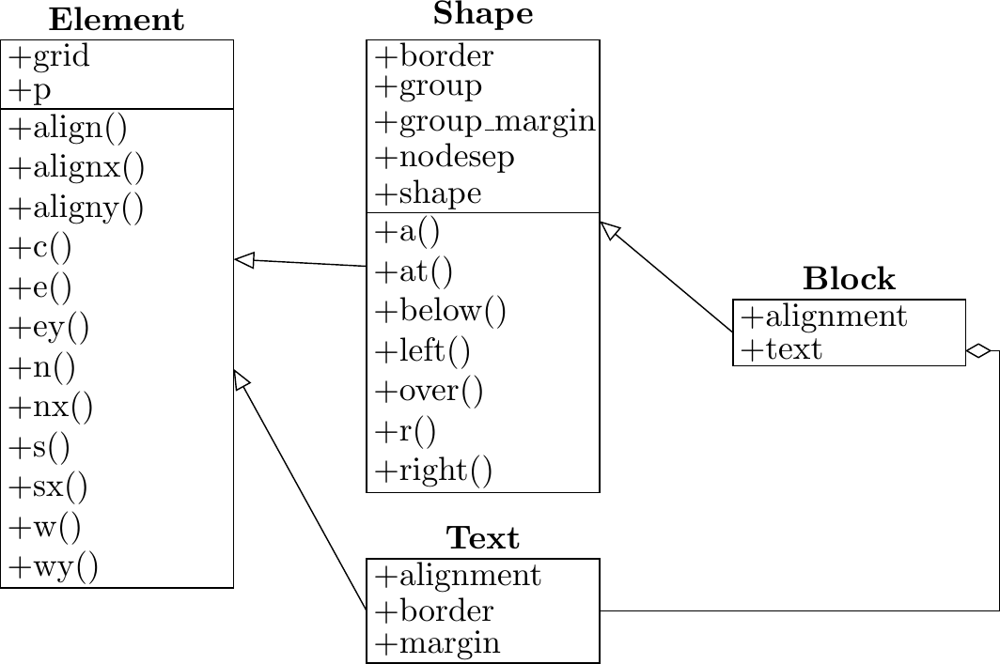

Welcome to BDP
==============

BDP (Block Diagrams in Python) aims to become a Python fronted for `TikZ <http://www.texample.net/tikz/>`_ when it comes to drawing block diagrams in order to facilitate the process. BDP wraps the `TikZ <http://www.texample.net/tikz/>`_ statements into the Python objects so that users can describe diagrams in pure Python. However, inserting raw `TikZ <http://www.texample.net/tikz/>`_ in BDP is also possible. Figure below shows an BDP example image which represents the BDP compilation process.

.. _fig-bdp-toolchain:

.. figure:: images/compile_process.png
    :width: 60%
    
    BDP example: BDP compilation process

Figure can be rendered with the following Python code:

.. literalinclude:: images/compile_process.py
    :caption: BDP description of the compilation process diagram.

Why BDP?
--------

BDP brings following benefits:

- Diagram description in Python which should render it more readable
- Step-by-step debugging of the diagram description
- Use the tools and design environments available for Python development (debugging, code completion, refactoring, documentation utilities...)
- Use vast Python library of packages

BDP features
------------

BDP package comprises:

- Python classes that wrap the Tikz statements
- Class for rendering PDF and PNG images from the Python description
- Shell entry point for rendering BDP images from command line
- Sphinx extensions for embedding BDP images into the Sphinx documents

.. _fig-uml:

    
    More complex example with Python programming involved

Where to start?
===============

Installation
------------

Install BDP using pip::
    
    pip install bdp

Install BDP using easy_install::
    
    easy_install bdp

Install BDP from source::
    
    python setup.py install

Read the documentation
----------------------

Start with the short tutorial :ref:`tutorial`

Checkout the examples
---------------------

Examples are located in the `examples <https://github.com/bogdanvuk/bdp/tree/master/examples>`_ repository folder.

Get involved
------------

Pull your copy from `github repository <https://github.com/bogdanvuk/bdp>`_

Contents:

.. toctree::
   :maxdepth: 2
   
   tutorial

Indices and tables
==================

* :ref:`genindex`
* :ref:`modindex`
* :ref:`search`
