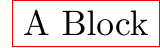
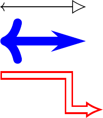

.. _tutorial:

BDP short tutorial
==================

Block diagrams consist mainly of blocks connected by lines, hence mainly two BDP objects will be used for drawing called *block* and *path*. All drawing objects in BDP are called **templates**. Templates carry descriptions of diagram components in form of many attributes which can be accessed, modified or added as a regular Python object attributes. New templates can be derived from the existing ones by calling them with a list of attributes that are be changed. Finally, the templates can be rendered to the diagram by passing them to the *fig* object.

All examples shown in this tutorial can be found in the bdp/doc/source/images folder of the bdp source code.

A simple block
--------------

The following examples shows how to render a simple block with the text using BDP.

.. literalinclude:: images/example1.py

Resulting in:

The *block* and templates derived from it, render to two *node* TikZ elements, one for the shape and the other for the text. Many *block* template attributes are rendered directly to the options list of a TikZ *node* with the following convention:

.. list-table::
   :widths: 17 22 30
   :header-rows: 1

   * - *node* option form
     - Corresponding BDP template setting
     - Description
   * - option=value
     - template.option = value
     - Set the desired value to the template attribute with the same name as the desired *node* option
   * - option
     - template.option = True
     - Set value of the template attribute of the same name as the desired *node* option to the boolean True. To unset the option, set it to False.
   * - option with spaces
     - template.option_with_spaces
     - TikZ option with spaces correspond to the template attribute of the same name with spaces replaced by underscores '_'

Some template attributes, however do not translate directly to the TikZ equivalents, and some of them are inferred in certain situations. These attributes include:

.. list-table::
   :widths: 10 20 20
   :header-rows: 1

   * - Attribute
     - TikZ equivalent option
     - Description
   * - p
     - at (p[0], p[1])
     - Determines the absolute position of the rendered node
   * - size
     - minimum width=size[0], minimum height=size[1]
     - Determines the size of the rendered node
   * - alignment
     - --
     - Determines the relative position of the text within a block
   * - border
     - draw
     - Determines whether the block template border is drawn

Template *a_template* is rendered to the following two TikZ elements by the rules given above:

.. code-block:: latex

   \node at (20.71pt, 6.47pt) [draw,minimum width=41.42pt,minimum height=12.94pt,color=red,rectangle] {} ;
   \node at (20.71pt, 6.47pt) [align=center,text width=35.42pt,minimum width=41.42pt,minimum height=12.94pt] {A Block} ;

Block relative position
-----------------------

Next example shows how BDP facilitates the relative positioning of the blocks in diagram.

.. literalinclude:: images/example2.py

Resulting in:

There are several helper methods used to position the blocks relatively to one another in diagram. The methods *over*, *right*, *left* and *below* all have the same form::

   template.method(other, pos=1)

These methods will position the *template* over, below, to the right or left of the passed *other* template. The *nodesep* attribute of the *other* template determines the spacing that should be made between the templates. The *nodesep* attribute value is multiplied by the passed *pos* argument.

The method *align* can be used to position two templates in such a way that their points (*other* and *own*) passed as arguments to this method, become overlapped::

   template.align(other, own)

The point relative to the template can be specified using helper methods: *e*, *n*, *s* and *w*

.. list-table::
   :header-rows: 1

   * - Method
     - Description
   * - n
     - Coordinate system with origin in top-left point of the template, with x as primary coordinate
   * - w
     - Coordinate system with origin in top-right point of the template, with y as primary coordinate
   * - s
     - Coordinate system with origin in bottom-left point of the template, with x as primary coordinate
   * - e
     - Coordinate system with origin in top-left point of the template, with y as primary coordinate

When an **int** value is supplied to these methods as a parameter, the value will be interpreted as an absolute unit. However, when a **float** value is supplied, it will be interpreted as a fraction of template's size. The following example shows how these methods can be used to determine the points relative to the template.

The function *prev* of the BDP package can be used to access the last template that has been derived in the script.

Text alignment within block
---------------------------

Text can be aligned within block using the alignment attribute. String of two characters are expected for the value of the alignment, the first one for the vertical and the second for the horizontal alignment. The following figure shows the available settings for the alignment attribute.

For the alignment setting, all combinations of the first and second character from the table below are valid.

.. list-table::
   :widths: 5 30 5 30
   :header-rows: 1

   * - First character
     - Vertical text position
     - Second character
     - Horizontal text position
   * - 't'
     - Above the top edge
     - 'w'
     - Left aligned
   * - 'n'
     - Below the top edge
     - 'c'
     - Center aligned
   * - 'c'
     - Vertically centered
     - 'e'
     - Right aligned
   * - 's'
     - Above the bottom edge
     -
     -
   * - 'b'
     - Below the bottom edge
     -
     -

Settings text attributes
------------------------

Text is an attribute of the *block* template and it is itself a template. Text attributes can be thus accessed as *template.text.attr*. Additionally as a shorthand, text attributes can be accessed as *template.text_attr*. The following example shows two ways of accessing text attributes.

.. literalinclude:: images/text_attr_access.py

Resulting in:

.. _fig_object:

The *fig* object
----------------

The *fig* object accepts the BDP templates via '<<' operator and memorizes their TikZ renderings in order to form complete TikZ image. Additionally *fig* memorizes the template objects too, and can be used to reference them. The templates can be referenced via their text attribute, or via order in which they were rendered. Both are done via indexing operator. When referencing via template text, wildcards '*' and '?' can be used. The following example demonstrates the two ways.

.. literalinclude:: images/fig_reference.py

Resulting in:

When adding a new template to the *fig* object that has the same text as the one added before, the number will be added to the end of the new templates text to form its key in order to make it unique. The *fig* object has following attributes that can be used to customize the TikZ rendering:

.. list-table::
   :widths: 10 30
   :header-rows: 1

   * - Attribute
     - Description
   * - grid
     - Scale between the BDP units and points (pt) in TikZ
   * - package
     - Python set containing package names that should be imported via \usepackage statement
   * - tikz_library
     - Python set containing tikz libraries that should be imported via \usetikzlibrary statement
   * - tikz_prolog
     - Latex statements between the \begin{document} and \begin{tikzpicture}
   * - options
     - Global options for TikZ picture
   * - tikz_epilog
     - Latex statements between the \end{tikzpicture} and \end{document}

*path* template
---------------

The *path* template is used to render wires in BDP diagrams. The *path* template operates similarly to the *block* and *text* templates. The difference is that it behaves as a container for a list of points that constitute a path and a list of line routing options stored in *route* attribute.

.. literalinclude:: images/line_example.py

Resulting in:

If *route* contains less items than there are point pairs, it is padded with value supplied to the *routedef* attribute.

The *path* template can also use new **arrays.meta** library (TeX Live 2014 contains the library out of the box) via *cap* template.

.. literalinclude:: images/arrows_meta.py

Resulting in:

The *group* template
--------------------

The *group* template behaves completely identical to the *fig* object when it comes to adding new templates to it and referencing them (they share a common superclass). Please refer to chapter :ref:`fig_object`. Furthermore *block*, *shape* and *text* templates have the same grouping functionality since they derive from *group* template, so this chapter applies to them as well. The *group* is a template and as such can be rendered. When a group is rendered to a *fig*, all its elements are rendered as well. When a group position is changed, the position of all its elements is shifted as well.

Important attribute of the *group* template is called *group* as well. When it is set to 'tight' (which is default for the *group* template), *group* size and position is recalculated whenever a new element is added in such a way that the *group* tightly encompass its all elements. When *group* attribute is set to None (which is default for*block*, *shape* and *text* templates), position and size of the group is independant of the size and position of its elements.

.. literalinclude:: images/group_example.py

Resulting in:

.. figure:: images/group_example.png
